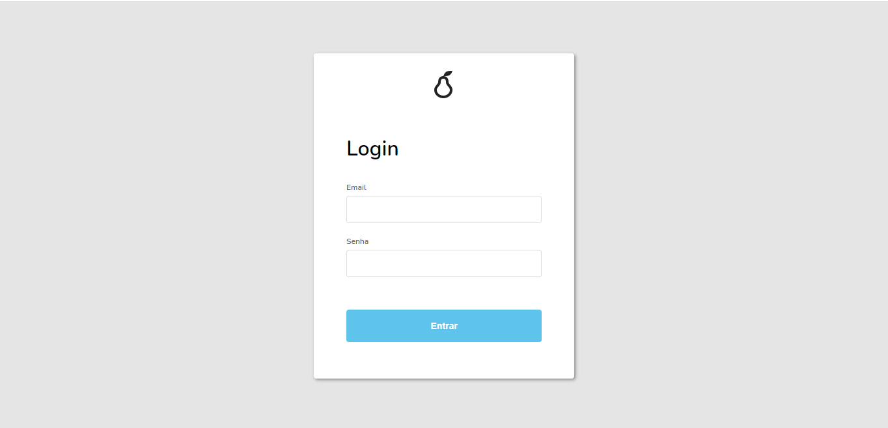

<h1 align="center">
  <br>
  
  <br>
  Concert Technologies Challenge
  <br>
</h1>


<p align="center">
  <a href="#tecnologies">Tecnologies</a> •
  <a href="#how-to-run">How To Run</a>
</p>

## Tecnologies

- Angular 9
- Json-Server

## How To Run

To clone and run this application, you'll need [Git](https://git-scm.com) and [Node.js](https://nodejs.org/en/download/) (which comes with [npm](http://npmjs.com)) installed on your computer. After Node.js is installed, you'll have to install [Angular](https://angular.io/guide/setup-local) From your command line:


```bash
# Clone this repository
$ git clone https://github.com/rafaelhbastos/concert-challenge

# Install dependencies
$ npm install
```

After following all the steps, you are ready to run this application. First of all you'll have to open two different terminals in order to run the front-end and the back-end.

 Starting with the server, you can run on your first terminal this command:

```bash
$ npm run start:serve
```

After that, run on your second terminal the following command to start the application:

```bash
$ npm start
```

Once you did it, you can open your browser and type "localhost:4200" and you'll see the screen like the image bellow.

<h1 align="center">
  
</h1>

For logging into the application, you have to fill the fields "email" and "senha" with "concert@technologies.com" and "challenge", respectively. 

Once you did it, then you can navigate through the application. You can see some images bellow.

<h1 align="center">
  
</h1>

<h1 align="center">
  
</h1>

<h1 align="center">
  
</h1>


